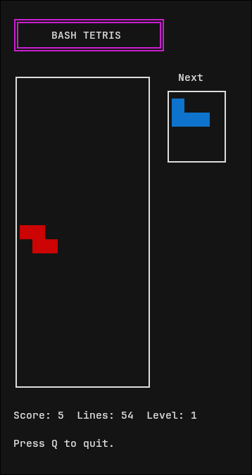

## A terminal based tetris written in only bash.  

<p align="center">
  
</p>

To play without downloading:  
```
bash -c "$(curl -fsSL https://raw.githubusercontent.com/benny-e/bash-tetris/main/tetris.sh)"
```
or clone the repository and download  
```
git clone https://github.com/benny-e/bash-tetris.git
cd bash-tetris
chmod +x tetris.sh
```
